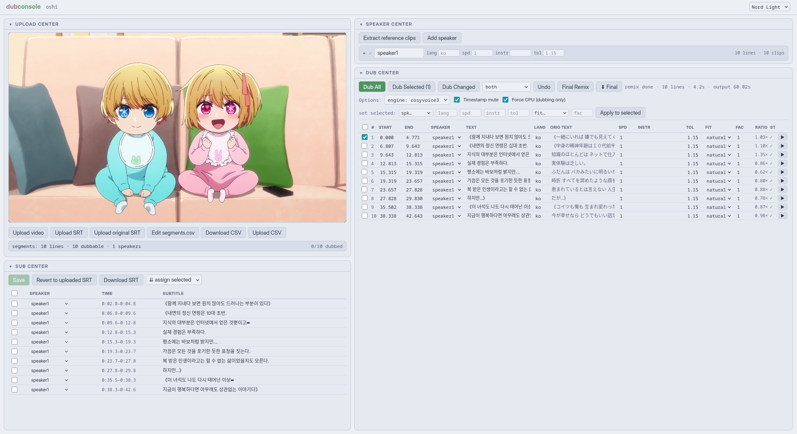

# Dubbing Webapp

Self-hosted, single-user web app for dubbing video using a pre-translated, timestamped SRT file and the original video file, with manual speaker diarization. Pipeline: SRT → speaker assignment → Demucs vocal/background separation → per-speaker reference clip extraction (with manual pruning) → TTS generation per line → time-fitting → final splice and mux.



## Run

```bash
git clone https://github.com/butterdori/dubcentral.git && cd dubcentral

python3.10 -m venv .venv && source .venv/bin/activate

pip install -r requirements.txt

# Clone and install CosyVoice
mkdir -p backend/vendor
git clone --recursive https://github.com/FunAudioLLM/CosyVoice.git backend/vendor/CosyVoice
cd backend/vendor/CosyVoice && pip install -r requirements.txt
cd -

# Download CosyVoice model (~1.5 GB)
python -c "from huggingface_hub import snapshot_download; snapshot_download('FunAudioLLM/Fun-CosyVoice3-0.5B-2512', local_dir='backend/hf_cache/Fun-CosyVoice3-0.5B')"

# Run tests (124 expected)
python -m pytest backend/tests -q

# Start server
uvicorn backend.main:app --host 0.0.0.0 --port 8765

```

Requires **ffmpeg/ffprobe on PATH**
